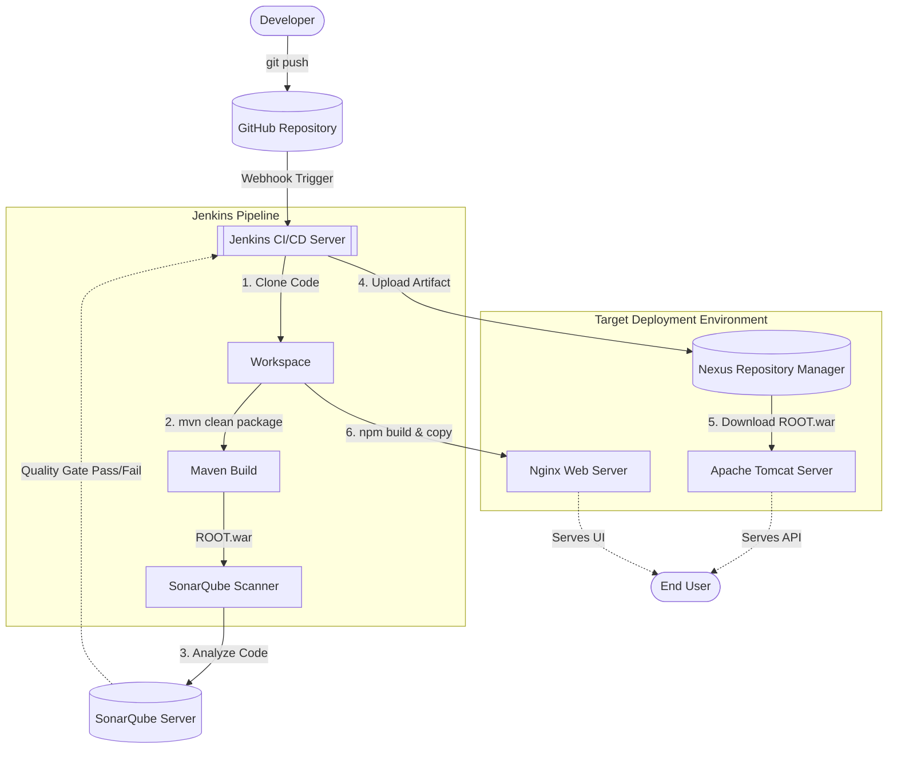

# Techwing AI Interview Platform - Deployment Architecture
**Presentation Outline & Content**

---

## Slide 1: Title Slide
**Title:** Techwing AI Interview Platform: CI/CD & Deployment Architecture
**Subtitle:** Streamlining our Build, Quality, and Release Pipelines
**Speaker/Presenter:** [Your Name/Team Name]

---

## Slide 2: High-Level Architecture Overview
**Heading:** The Big Picture
**Bullet Points:**
*   **Infrastructure:** Hosted on AWS EC2 instances.
*   **Version Control:** GitHub for source code management.
*   **CI/CD Engine:** Jenkins orchestrating the entire lifecycle via automated jobs.
*   **Backend Stack:** Spring Boot built with Maven, deployed as a `.war` to Apache Tomcat.
*   **Frontend Stack:** React.js built with Node/npm, served statically via Nginx.
*   **Quality & Storage:** SonarQube for code analysis and Nexus for artifact repository management.

---

## Slide 3: Deployment Flowchart (Visual)
*(Copy this diagram or create a visual flowchart in PPT based on it)*

---

## Slide 4: Control Flow Breakdown (Step-by-Step)
**Heading:** How Control Moves Through the Pipeline

**1. Trigger Phase (GitHub ➡️ Jenkins)**
*   A developer pushes code to the `main` branch.
*   GitHub sends a JSON payload via a Webhook to Jenkins.
*   Jenkins acknowledges the trigger and initiates a new build job.

**2. Build & Analyze Phase (Jenkins ➡️ Maven ➡️ SonarQube)**
*   Jenkins clones the latest codebase into its workspace.
*   Jenkins invokes Maven to compile the Java backend, skipping tests to optimize speed, generating `ROOT.war`.
*   Control passes to the SonarScanner plugin, which reads the compiled code and pushes it to the SonarQube server via port `9000`.
*   The pipeline halts momentarily to wait for SonarQube's Quality Gate result.

**3. Storage & Deployment Phase (Jenkins ➡️ Nexus ➡️ Tomcat/Nginx)**
*   If the Quality Gate passes (or is configured to warn only), control moves to the Nexus Artifact Uploader.
*   Jenkins pushes `ROOT.war` over HTTP to Nexus (port `8085`) into the `techwing-releases` repository.
*   **Backend Deploy:** Jenkins executes shell commands on the EC2 instance to stop Tomcat, fetch the exact versioned `.war` from Nexus, place it in `webapps/`, and restart Tomcat.
*   **Frontend Deploy:** Jenkins shifts context to the `frontend` directory, runs `npm install` and `npm run build`, then copies the generated static assets to `/var/www/techwing`, concluding by reloading Nginx.

---

## Slide 5: Code Quality Assurance (SonarQube)
**Heading:** Ensuring Clean & Secure Code
**Bullet Points:**
*   **Integration:** Triggered automatically post-build via Maven (`mvn sonar:sonar`).
*   **What it does:** 
    *   Detects hard-coded secrets (Security Hotspots).
    *   Identifies Code Smells (maintainability issues).
    *   Finds potential bugs.
*   **Quality Gates:** Acts as a checkpoint; if the code is severely flawed, the pipeline is flagged, preventing bad code from reaching production.

---

## Slide 6: Artifact Management (Nexus)
**Heading:** Versioning & Storing Releases
**Bullet Points:**
*   **Role:** Acts as our single source of truth for compiled binaries (WAR files).
*   **Repository Type:** Hosted Maven2 Repository (`techwing-releases`).
*   **Workflow:** 
    *   Jenkins uploads the artifact tagged with the Jenkins `${BUILD_NUMBER}`.
    *   During deployment, Tomcat doesn't build the code; it downloads the pre-built, verified artifact from Nexus.
*   **Benefits:** Easy rollbacks, traceability, and separation of the build process from the deployment process.

---

## Slide 7: Benefits of this Architecture
**Heading:** Why We Built It This Way
**Bullet Points:**
*   **Zero-Touch Deployments:** Code pushed to GitHub automatically goes live if it passes all checks.
*   **Traceability:** Every release in Nexus maps directly to a Jenkins build number and Git commit.
*   **High Quality:** SonarQube prevents technical debt and security vulnerabilities from compounding.
*   **Scalable & Modular:** The frontend, backend, and artifact storage are distinct components that can be scaled independently.

---

## Slide 8: Q&A
**Title:** Questions?
**Subtitle:** Thank you for your time.
