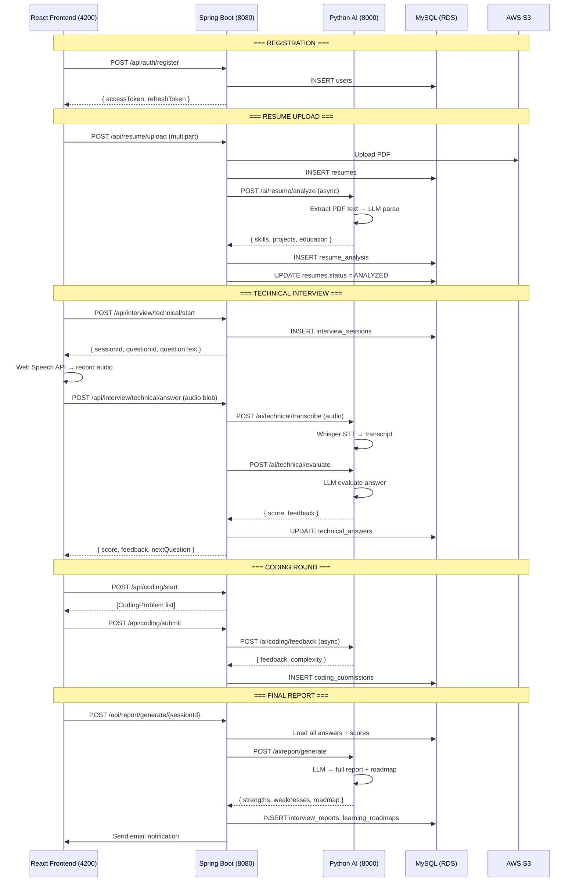

# TechWings AI Interview Platform
## Complete Schema, System Design & Integration Guide

---

## 🗃️ Database Schema — Entity Relationship Diagram

```mermaid
erDiagram
    users {
        BIGINT id PK
        VARCHAR name
        VARCHAR email UK
        VARCHAR pin_hash
        VARCHAR branch
        VARCHAR phone
        VARCHAR college
        ENUM role "STUDENT|TRAINER|ADMIN"
        BOOLEAN is_active
        DATETIME created_at
        DATETIME updated_at
    }

    technology_tracks {
        BIGINT id PK
        VARCHAR name UK
        TEXT description
        VARCHAR icon_url
        BOOLEAN is_active
        BIGINT created_by FK
        DATETIME created_at
    }

    interview_configurations {
        BIGINT id PK
        BIGINT track_id FK
        INT technical_question_count
        INT technical_time_minutes
        INT coding_problem_count
        INT coding_time_minutes
        INT hr_question_count
        INT hr_time_minutes
        BOOLEAN is_active
        DATETIME created_at
    }

    resumes {
        BIGINT id PK
        BIGINT user_id FK UK
        VARCHAR s3_url
        VARCHAR file_name
        INT file_size_kb
        ENUM status "UPLOADED|ANALYZING|ANALYZED|FAILED"
        DATETIME uploaded_at
        DATETIME analyzed_at
    }

    resume_analysis {
        BIGINT id PK
        BIGINT resume_id FK UK
        BIGINT user_id FK
        JSON skills
        JSON projects
        JSON education
        JSON certifications
        DOUBLE experience_years
        TEXT summary
        TEXT ai_raw_response
        DATETIME created_at
    }

    interview_sessions {
        BIGINT id PK
        BIGINT user_id FK
        BIGINT track_id FK
        BIGINT config_id FK
        ENUM status
        DOUBLE technical_score
        DOUBLE coding_score
        DOUBLE hr_score
        DOUBLE overall_score
        ENUM recommendation
        DATETIME started_at
        DATETIME technical_end_at
        DATETIME coding_end_at
        DATETIME hr_end_at
        DATETIME completed_at
        DATETIME created_at
    }

    technical_questions {
        BIGINT id PK
        BIGINT track_id FK
        TEXT question_text
        TEXT expected_answer
        ENUM difficulty "EASY|MEDIUM|HARD"
        VARCHAR category
        JSON tags
        BOOLEAN is_active
        BIGINT created_by FK
        DATETIME created_at
    }

    technical_answers {
        BIGINT id PK
        BIGINT session_id FK
        BIGINT question_id FK
        INT question_order
        VARCHAR audio_s3_url
        TEXT transcript
        DOUBLE score
        DOUBLE accuracy_score
        DOUBLE depth_score
        DOUBLE communication_score
        TEXT ai_feedback
        DATETIME answered_at
        DATETIME created_at
    }

    coding_problems {
        BIGINT id PK
        BIGINT track_id FK
        VARCHAR title
        LONGTEXT description
        ENUM difficulty
        TEXT constraints
        TEXT sample_input
        TEXT sample_output
        JSON hidden_test_cases
        INT time_limit_ms
        INT memory_limit_mb
        JSON tags
        BOOLEAN is_active
        BIGINT created_by FK
        DATETIME created_at
    }

    coding_submissions {
        BIGINT id PK
        BIGINT session_id FK
        BIGINT problem_id FK
        ENUM language "JAVA|PYTHON|JAVASCRIPT|CPP"
        LONGTEXT code
        ENUM submission_type "RUN|SUBMIT"
        ENUM status
        INT total_test_cases
        INT passed_test_cases
        INT execution_time_ms
        INT memory_used_mb
        TEXT stderr
        TEXT ai_feedback
        DATETIME submitted_at
    }

    hr_questions {
        BIGINT id PK
        TEXT question_text
        ENUM category "INTRO|MOTIVATION|BEHAVIORAL|SITUATIONAL|CULTURAL_FIT"
        BOOLEAN is_active
        BIGINT created_by FK
        DATETIME created_at
    }

    hr_answers {
        BIGINT id PK
        BIGINT session_id FK
        BIGINT question_id FK
        INT question_order
        VARCHAR audio_s3_url
        TEXT transcript
        DOUBLE confidence_score
        DOUBLE communication_score
        DOUBLE fluency_score
        DOUBLE grammar_score
        DOUBLE leadership_score
        DOUBLE positivity_score
        DOUBLE professionalism_score
        DOUBLE overall_hr_score
        TEXT ai_feedback
        DATETIME answered_at
        DATETIME created_at
    }

    interview_reports {
        BIGINT id PK
        BIGINT session_id FK UK
        BIGINT user_id FK
        DOUBLE technical_score
        DOUBLE coding_score
        DOUBLE hr_score
        DOUBLE overall_score
        ENUM recommendation
        JSON strengths
        JSON weaknesses
        JSON technical_breakdown
        JSON hr_breakdown
        JSON coding_breakdown
        TEXT ai_summary
        VARCHAR pdf_s3_url
        BOOLEAN email_sent
        DATETIME generated_at
    }

    learning_roadmaps {
        BIGINT id PK
        BIGINT session_id FK UK
        BIGINT user_id FK
        JSON roadmap_json
        DATETIME generated_at
    }

    refresh_tokens {
        BIGINT id PK
        BIGINT user_id FK
        VARCHAR token UK
        DATETIME expires_at
        BOOLEAN revoked
        DATETIME created_at
    }

    users ||--o{ resumes : "has one"
    users ||--o{ interview_sessions : "participates in"
    users ||--o{ resume_analysis : "has analysis"
    users ||--o{ interview_reports : "receives"
    users ||--o{ learning_roadmaps : "gets roadmap"
    users ||--o{ refresh_tokens : "has tokens"
    technology_tracks ||--o{ interview_configurations : "configured by"
    technology_tracks ||--o{ technical_questions : "has questions"
    technology_tracks ||--o{ coding_problems : "has problems"
    technology_tracks ||--o{ interview_sessions : "used in"
    interview_sessions ||--o{ technical_answers : "contains"
    interview_sessions ||--o{ coding_submissions : "contains"
    interview_sessions ||--o{ hr_answers : "contains"
    interview_sessions ||--|| interview_reports : "generates"
    interview_sessions ||--|| learning_roadmaps : "generates"
    technical_questions ||--o{ technical_answers : "answered in"
    coding_problems ||--o{ coding_submissions : "submitted for"
    hr_questions ||--o{ hr_answers : "answered in"
```

---

## 🏗️ System Architecture Flow



---

## 🌐 REST API Endpoints Reference

### Auth APIs
| Method | URL | Body | Response | Auth |
|--------|-----|------|----------|------|
| POST | `/api/auth/register` | RegisterRequest | AuthResponse | Public |
| POST | `/api/auth/login` | LoginRequest | AuthResponse | Public |
| POST | `/api/auth/refresh` | `?refreshToken=...` | AuthResponse | Public |
| POST | `/api/auth/logout` | `?refreshToken=...` | Success | Public |

### Resume APIs
| Method | URL | Body | Response | Auth |
|--------|-----|------|----------|------|
| POST | `/api/resume/upload` | Multipart PDF | Resume | JWT |
| GET | `/api/resume/status` | — | Status string | JWT |
| GET | `/api/resume/analysis` | — | ResumeAnalysis | JWT |
| GET | `/api/resume/preview` | — | Pre-signed URL | JWT |

### Interview APIs (Technical)
| Method | URL | Body | Response | Auth |
|--------|-----|------|----------|------|
| POST | `/api/interview/technical/start` | — | InterviewStartResponse | JWT |
| POST | `/api/interview/technical/answer` | AnswerRequest | AnswerEvalResponse | JWT |
| GET | `/api/interview/technical/next` | `?sessionId=` | QuestionResponse | JWT |
| POST | `/api/interview/technical/complete` | `?sessionId=` | Success | JWT |

### Interview APIs (HR)
| Method | URL | Body | Response | Auth |
|--------|-----|------|----------|------|
| POST | `/api/interview/hr/start` | — | InterviewStartResponse | JWT |
| POST | `/api/interview/hr/answer` | AnswerRequest | AnswerEvalResponse | JWT |
| GET | `/api/interview/hr/next` | `?sessionId=` | QuestionResponse | JWT |
| POST | `/api/interview/hr/complete` | `?sessionId=` | Success | JWT |

### Coding APIs
| Method | URL | Body | Response | Auth |
|--------|-----|------|----------|------|
| POST | `/api/coding/start` | — | CodingProblem[] | JWT |
| GET | `/api/coding/problem/{id}` | — | CodingProblem | JWT |
| POST | `/api/coding/run` | CodeRunRequest | CodeRunResponse | JWT |
| POST | `/api/coding/submit` | CodeRunRequest | CodeRunResponse | JWT |
| POST | `/api/coding/complete` | `?sessionId=` | Success | JWT |

### Report APIs
| Method | URL | Body | Response | Auth |
|--------|-----|------|----------|------|
| POST | `/api/report/generate/{sessionId}` | — | Success | JWT |
| GET | `/api/report/{sessionId}` | — | ReportResponse | JWT |
| GET | `/api/report/{sessionId}/download` | — | PDF URL | JWT |
| GET | `/api/report/{sessionId}/roadmap` | — | LearningRoadmap | JWT |
| GET | `/api/report/my-reports` | — | ReportResponse[] | JWT |

### Dashboard & Analytics
| Method | URL | Response | Auth |
|--------|-----|----------|------|
| GET | `/api/dashboard/student` | DashboardResponse | JWT (STUDENT) |
| GET | `/api/analytics/overview` | Platform stats | JWT (ADMIN/TRAINER) |
| GET | `/api/analytics/leaderboard` | Top 10 scores | JWT (ADMIN/TRAINER) |
| GET | `/api/analytics/track/{id}` | Track stats | JWT (ADMIN/TRAINER) |
| GET | `/api/analytics/student/{id}` | Student stats | JWT (ADMIN/TRAINER) |

### Admin APIs
| Method | URL | Auth |
|--------|-----|------|
| GET/POST/PUT/DELETE | `/api/admin/tracks` | ADMIN/TRAINER |
| GET/POST/DELETE | `/api/admin/questions/{trackId}` | ADMIN/TRAINER |
| GET/POST | `/api/admin/coding-problems/{trackId}` | ADMIN/TRAINER |
| GET/POST | `/api/admin/hr-questions` | ADMIN/TRAINER |
| GET | `/api/admin/students` | ADMIN/TRAINER |
| GET | `/api/admin/students/{id}/sessions` | ADMIN/TRAINER |
| PUT | `/api/admin/users/{id}/activate` | ADMIN |

---

## 🐍 Python AI Service — API Endpoints

| Method | URL | Purpose |
|--------|-----|---------|
| POST | `/ai/resume/analyze` | Extract skills, projects from PDF |
| POST | `/ai/technical/transcribe` | Audio → transcript (Whisper) |
| POST | `/ai/technical/evaluate` | Evaluate technical answer |
| POST | `/ai/hr/transcribe` | Audio → transcript (Whisper) |
| POST | `/ai/hr/evaluate` | Evaluate HR answer (7 dimensions) |
| POST | `/ai/coding/feedback` | Code quality + complexity analysis |
| POST | `/ai/report/generate` | Full report + roadmap generation |
| POST | `/ai/tts/generate` | Text → speech audio |
| GET | `/health` | Service health check |
| GET | `/docs` | Swagger UI (auto-generated) |

---

## 🔧 How to Run Everything

### 1. Start MySQL
```sql
CREATE DATABASE techwings_db CHARACTER SET utf8mb4 COLLATE utf8mb4_unicode_ci;
```

### 2. Start Spring Boot Backend
```bash
cd "techwing ai interview"
mvn spring-boot:run
# Runs on http://localhost:8080
# Swagger: http://localhost:8080/swagger-ui.html
```

### 3. Start Python AI Service
```bash
cd python-ai
python -m venv venv
venv\Scripts\activate       # Windows
pip install -r requirements.txt
# Edit .env → set OPENAI_API_KEY or GOOGLE_API_KEY
uvicorn main:app --host 0.0.0.0 --port 8000 --reload
# Swagger: http://localhost:8000/docs
```

### 4. Start React Frontend
```bash
cd frontend
npm install
npm start     # or: ng serve (Angular)
# Runs on http://localhost:4200
```

---

## ⚙️ Score Calculation Formula

```
Overall Score = (Technical × 0.40) + (Coding × 0.35) + (HR × 0.25)

Technical Score  = Average of all TechnicalAnswer.score × 10
Coding Score     = (Total passed test cases / Total test cases) × 100
HR Score         = Average of all HRAnswer.overall_hr_score × 10

Recommendation:
  ≥ 85 → STRONGLY_RECOMMENDED
  ≥ 70 → RECOMMENDED
  ≥ 55 → BORDERLINE
  < 55 → NOT_RECOMMENDED
```

---

## 📁 Complete Project Folder Structure

```
techwing ai interview/
├── pom.xml
├── src/
│   └── main/
│       ├── java/com/example/Techwing/
│       │   ├── TechwingAiInterviewPlatformApplication.java
│       │   ├── controller/
│       │   │   ├── AuthController.java
│       │   │   ├── ResumeController.java
│       │   │   ├── InterviewController.java
│       │   │   ├── CodingController.java
│       │   │   ├── ReportController.java
│       │   │   ├── DashboardController.java
│       │   │   ├── AnalyticsController.java
│       │   │   └── AdminController.java
│       │   ├── service/
│       │   │   ├── AuthService.java
│       │   │   ├── ResumeService.java
│       │   │   ├── InterviewService.java
│       │   │   ├── CodingService.java
│       │   │   ├── ReportService.java
│       │   │   ├── AnalyticsService.java
│       │   │   ├── NotificationService.java
│       │   │   └── AIClientService.java       ← NEW (calls Python)
│       │   ├── service/implementation/
│       │   │   ├── AuthServiceImpl.java
│       │   │   ├── ResumeServiceImpl.java     ← Updated with AI
│       │   │   ├── InterviewServiceImpl.java
│       │   │   ├── CodingServiceImpl.java
│       │   │   ├── ReportServiceImpl.java
│       │   │   ├── AnalyticsServiceImpl.java
│       │   │   └── NotificationServiceImpl.java
│       │   ├── models/         (15 entities + 10 enums)
│       │   ├── repository/     (15 JPA repositories)
│       │   ├── payload/        (11 DTOs)
│       │   ├── exception/      (7 exception classes)
│       │   └── securityconfig/ (JWT, Filter, SecurityConfig, AppConfig)
│       └── resources/
│           └── application.properties
│
└── python-ai/                              ← Python FastAPI AI Service
    ├── main.py
    ├── config.py
    ├── requirements.txt
    ├── .env
    ├── agents/
    │   ├── resume_agent.py
    │   ├── technical_agent.py
    │   ├── hr_agent.py
    │   ├── coding_agent.py
    │   └── report_agent.py
    ├── services/
    │   ├── stt_service.py
    │   ├── tts_service.py
    │   └── pdf_service.py
    ├── routers/
    │   ├── resume_router.py
    │   ├── technical_router.py
    │   ├── hr_router.py
    │   ├── coding_router.py
    │   ├── report_router.py
    │   └── tts_router.py
    └── models/
        └── schemas.py
```

---

## 🔌 Frontend → Backend Connection (React)

### 1. Install Axios
```bash
npm install axios
```

### 2. Create `src/api/axios.js`
```js
import axios from 'axios';

const api = axios.create({
  baseURL: 'http://localhost:8080',
  headers: { 'Content-Type': 'application/json' }
});

// Attach JWT token to every request
api.interceptors.request.use(config => {
  const token = localStorage.getItem('accessToken');
  if (token) config.headers.Authorization = `Bearer ${token}`;
  return config;
});

// Auto-refresh token on 401
api.interceptors.response.use(
  res => res,
  async err => {
    if (err.response?.status === 401) {
      const refreshToken = localStorage.getItem('refreshToken');
      if (refreshToken) {
        const { data } = await axios.post(
          `http://localhost:8080/api/auth/refresh?refreshToken=${refreshToken}`
        );
        localStorage.setItem('accessToken', data.data.accessToken);
        err.config.headers.Authorization = `Bearer ${data.data.accessToken}`;
        return axios(err.config);
      }
      localStorage.clear();
      window.location.href = '/login';
    }
    return Promise.reject(err);
  }
);

export default api;
```

### 3. Create `src/api/services.js`
```js
import api from './axios';

// Auth
export const authAPI = {
  register:     (data)          => api.post('/api/auth/register', data),
  login:        (data)          => api.post('/api/auth/login', data),
  logout:       (refreshToken)  => api.post(`/api/auth/logout?refreshToken=${refreshToken}`),
};

// Resume
export const resumeAPI = {
  upload:       (file)          => { const f = new FormData(); f.append('file', file); return api.post('/api/resume/upload', f, { headers: {'Content-Type': 'multipart/form-data'} }); },
  getStatus:    ()              => api.get('/api/resume/status'),
  getAnalysis:  ()              => api.get('/api/resume/analysis'),
  getPreview:   ()              => api.get('/api/resume/preview'),
};

// Interview
export const interviewAPI = {
  startTechnical:    ()          => api.post('/api/interview/technical/start'),
  submitTechnical:   (data)      => api.post('/api/interview/technical/answer', data),
  nextTechnical:     (sessionId) => api.get(`/api/interview/technical/next?sessionId=${sessionId}`),
  completeTechnical: (sessionId) => api.post(`/api/interview/technical/complete?sessionId=${sessionId}`),
  startHR:           ()          => api.post('/api/interview/hr/start'),
  submitHR:          (data)      => api.post('/api/interview/hr/answer', data),
  nextHR:            (sessionId) => api.get(`/api/interview/hr/next?sessionId=${sessionId}`),
  completeHR:        (sessionId) => api.post(`/api/interview/hr/complete?sessionId=${sessionId}`),
};

// Coding
export const codingAPI = {
  start:   ()     => api.post('/api/coding/start'),
  getProblem: (id)=> api.get(`/api/coding/problem/${id}`),
  run:     (data) => api.post('/api/coding/run', data),
  submit:  (data) => api.post('/api/coding/submit', data),
  complete:(id)   => api.post(`/api/coding/complete?sessionId=${id}`),
};

// Report
export const reportAPI = {
  generate:    (sessionId) => api.post(`/api/report/generate/${sessionId}`),
  get:         (sessionId) => api.get(`/api/report/${sessionId}`),
  download:    (sessionId) => api.get(`/api/report/${sessionId}/download`),
  getRoadmap:  (sessionId) => api.get(`/api/report/${sessionId}/roadmap`),
  getMyReports:()          => api.get('/api/report/my-reports'),
};

// Dashboard
export const dashboardAPI = {
  getStudent: () => api.get('/api/dashboard/student'),
};

// Analytics (Admin/Trainer)
export const analyticsAPI = {
  overview:    ()       => api.get('/api/analytics/overview'),
  leaderboard: ()       => api.get('/api/analytics/leaderboard'),
  track:       (id)     => api.get(`/api/analytics/track/${id}`),
  student:     (userId) => api.get(`/api/analytics/student/${userId}`),
};
```

---

## 🎙️ Voice Recording in React (Web Speech API)

```js
// src/hooks/useVoiceRecorder.js
import { useState, useRef } from 'react';

export const useVoiceRecorder = () => {
  const [recording, setRecording] = useState(false);
  const [audioBlob, setAudioBlob] = useState(null);
  const mediaRef = useRef(null);
  const chunksRef = useRef([]);

  const startRecording = async () => {
    const stream = await navigator.mediaDevices.getUserMedia({ audio: true });
    mediaRef.current = new MediaRecorder(stream);
    chunksRef.current = [];
    mediaRef.current.ondataavailable = e => chunksRef.current.push(e.data);
    mediaRef.current.onstop = () => {
      const blob = new Blob(chunksRef.current, { type: 'audio/webm' });
      setAudioBlob(blob);
    };
    mediaRef.current.start();
    setRecording(true);
  };

  const stopRecording = () => {
    mediaRef.current?.stop();
    setRecording(false);
  };

  const uploadAudio = async (sessionId, questionOrder, roundType) => {
    if (!audioBlob) return null;
    const formData = new FormData();
    formData.append('audio', audioBlob, 'answer.webm');
    // Send to backend which forwards to Python AI for STT
    const { interviewAPI } = await import('./api/services');
    return await interviewAPI.submitTechnical({
      sessionId, questionOrder,
      audioS3Url: null,  // will be filled by backend
      transcript: null   // Python AI will transcribe
    });
  };

  return { recording, audioBlob, startRecording, stopRecording, uploadAudio };
};
```

---

> [!IMPORTANT]
> **Environment Setup Checklist**
> 1. Set `OPENAI_API_KEY` in `python-ai/.env`
> 2. Set MySQL credentials in `application.properties`
> 3. Set AWS S3 credentials in `application.properties` (for file storage)
> 4. Start MySQL → Spring Boot → Python AI → React **in that order**

> [!NOTE]
> **Free Tier Alternative**: Instead of OpenAI, use `LLM_PROVIDER=google` and set `GOOGLE_API_KEY` (Gemini Pro is free for development). Change `config.py` to use `ChatGoogleGenerativeAI`.
